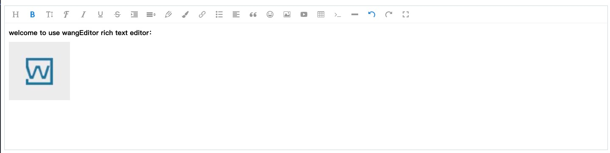

# wangEditor

<!-- Badge -->


<!-- PROJECT LOGO -->
<br />
<p align="center">
  <a href="http://www.wangeditor.com/">
    
  </a>

  <h3 align="center">wangEditor</h3>

  <p align="center">
    A lightweight rich text editor, friendly api and use extremely conventient.
    <br />
    <a href="http://www.wangeditor.com"><strong>Offical website</strong></a>
    ·
    <a href="http://www.wangeditor.com/doc/"><strong>Explore the docs »</strong></a>
    <br />
    <br />
    <a href="./README-zh-cn.md">Chinese docs</a>
    ·
    <a href="https://codepen.io/collection/DNmPQV">View Demo</a>
    ·
    <a href="https://github.com/wangeditor-team/wangEditor/issues/new?template=bug.md">Report Bug</a>
    ·
    <a href="https://github.com/wangeditor-team/wangEditor/issues/new?template=feature.md">Request Feature</a>
  </p>
</p>

<!-- ABOUT THE PROJECT -->
## About The Project

WangEditor is a web rich editor that use typescript develop. It depends on native `execCommand API` and `selection API`. It's lightweight, simple, use convience and open source.

It support most of modern browsers: Chrome, Firefox, Safar, Edge, QQ, IE11 and so on, not support mobile browers.

At present, the lastest version is v4.



## Usage

### Use NPM package
```sh
npm install wangeditor --save
``` 
A few lines code for creating editor instance：

```js
import E from "wangeditor";
const editor = new E("#div1");
editor.create();
```

### Use CDN
```html
<script type="text/javascript" src="https://unpkg.com/wangeditor/dist/wangEditor.min.js"></script>
<script type="text/javascript">
  const E = window.wangEditor
  const editor = new E('#div1')
  // or const editor = new E(document.getElementById('div1'))
  editor.create()
</script>
```

<!-- CONTRIBUTING -->
## Contributing

Contributions are what make the open source community such an amazing place to be learn, inspire, and create. Any contributions you make are **greatly appreciated**.

1. Fork the Project
2. Create your Feature Branch (`git checkout -b feature-amazing-feature`)
3. Commit your Changes (`git commit -m 'feat: Add some amazing feature'`)
4. Push to the Branch (`git push origin feature-amazing-feature`)
5. Open a Pull Request


<!-- LICENSE -->
## License

Distributed under the MIT License. See [MIT License](https://en.wikipedia.org/wiki/MIT_license) for more information.

<!-- CONTACT -->
## Contact

Wangfupeng - wangfupeng1988@163.com

Project Link: [https://github.com/wangeditor-team/wangEditor](https://github.com/wangeditor-team/wangEditor)

## Developer team
We have a professional developer team, if you want to join us, you can send email to `wangfupeng1988@163.com`.

If you are a chinese developer, you can join our QQ group or read [chinese](./README-zh-cn.md) docs for more information.

## Support us

Your support will encourage us to output more quality content


